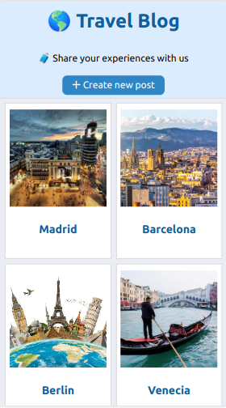

# Travel Blog



## ✅ Requirements

This project is a responsive website to share experiences about travels in cities around the world.
The users will be able to:
- Create new posts
- Show a list of posts
- Update a post
- Delete a post

All information about the posts are sent and received from an external web server. 
The external web server stores the posts into a local sqlite database and exposes an API Rest.

## 🛠️ Build with
- [NodeJS](https://nodejs.org)
- [TypeScript](https://www.typescriptlang.org/)
- [React](https://es.reactjs.org/)
- [React Router](https://reactrouter.com/)
- [CSS Modules](https://create-react-app.dev/docs/adding-a-css-modules-stylesheet)
- [Prettier](https://prettier.io)
- [Font Awesome](https://fontawesome.com/v5/docs/web/use-with/react/)
- [Docker](https://www.docker.com/)
- [WebStorm](https://www.jetbrains.com/webstorm/)

## Local environment

**Important:** Before running the React application, you will need run the backend API using:

```
docker-compose up
```

We are using the [wefoxgroup/wg-web-challenge](https://hub.docker.com/r/wefoxgroup/wg-web-challenge) docker image.

### Available Scripts

In the project directory, you can run:

### `npm start`

Runs the app in the development mode.\
Open [http://localhost:3000](http://localhost:3000) to view it in the browser.

The page will reload if you make edits.\
You will also see any lint errors in the console.

### `npm run build`

Builds the app for production to the `build` folder.\
It correctly bundles React in production mode and optimizes the build for the best performance.

The build is minified and the filenames include the hashes.\
Your app is ready to be deployed!

See the section about [deployment](https://facebook.github.io/create-react-app/docs/deployment) for more information.
